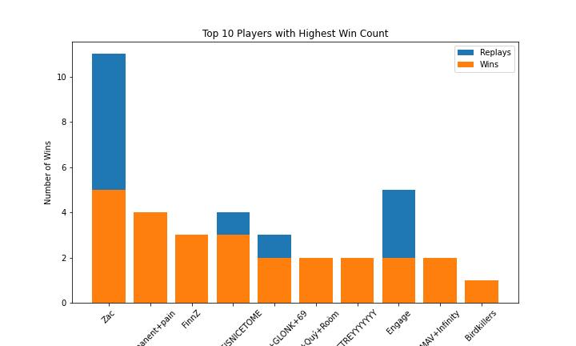

# Replays Analysis

This project aims to analyze game replays from the popular online game League of Legends. The script provided in this repository, `replays_analysis.ipynb`, utilizes web scraping techniques to gather data from the website "www.leagueofgraphs.com" and perform various analyses on the collected information.

## Table of Contents
- [Introduction](#introduction)
- [Project Structure](#project-structure)
- [Data Analysis](#data-analysis)
- [Visualizations](#visualizations)
- [Conclusion](#conclusion)

## Introduction
As an aspiring Machine Learning Engineer and a passionate League of Legends player, I created this project to showcase my skills in web scraping, data analysis, and visualization. The goal was to extract game data from "www.leagueofgraphs.com" and gain insights into player performance, game outcomes, and the relationship between individual and team performances.

League of Legends is a highly competitive team-based game where players control unique champions with distinct abilities. The game's outcome is determined by factors such as teamwork, strategy, and individual player performance. By analyzing replays and player statistics, valuable insights can be gained to understand patterns, strategies, and individual contributions to victory.

## Project Structure
The project is contained in a single Jupyter Notebook file, `replays_analysis.ipynb`. The script follows a sequential flow to gather data, perform analysis, and generate visualizations.

The script utilizes the following main libraries:
- `requests` for making HTTP requests to the website
- `BeautifulSoup` for parsing the HTML data
- `pandas` for data manipulation and analysis
- `numpy` for numerical computations
- `matplotlib` for generating visualizations

## Data Analysis
The script begins by defining the necessary functions and variables. It sets up the required headers for making requests and defines special names for certain champions. It also allows customization of the champion, role, rank, and the number of pages to analyze.

The main data scraping and analysis tasks include:
1. Scraping player data and game statistics from the League of Legends website.
2. Calculating key metrics such as win rate and average KDA (Kill/Death/Assist ratio) for each player.
3. Creating a table of players with the most games on the selected champion and role, including their statistics and the number of replays available.
4. Analyzing individual game replays for a specific player, including the link to the replay and the player's KDA for each game.
5. Analyzing the KDA performance of other players in the same game and identifying games where the player's team performed poorly in terms of KDA compared to the enemy team.

The script provides three main tables as outputs:
1. Table of players with the most games on the selected champion and role, including their win rate, average KDA, number of replays, and a link to their profile.
2. Table of specific game replays for a given player, including the link to the replay and the player's KDA in that game.
3. Table analyzing the KDA performance of other players in the same game as the given player, highlighting games where the player's team underperformed compared to the enemy team.

## Visualizations
The project also includes visualizations to provide a more intuitive understanding of the data. The two main visualizations are as follows:

1. **Top 10 Players with Highest Win Count**: A bar chart showcasing the top 10 players with the highest number of wins on the selected champion and role. This visualization helps identify players who have achieved significant success and showcases their dominance in terms of victories.

2. **Performance Difference between Allies and Enemies**: A scatter plot depicting the performance difference (KDA) between the player's team and the enemy team for each game played. Positive values indicate superior performance by the player's team, while negative values suggest underperformance. This visualization helps identify games where the player's team struggled but still managed to secure a victory.

## Conclusion
This project demonstrates my skills in web scraping, data analysis, and visualization using League of Legends game data. By extracting and analyzing replays from "www.leagueofgraphs.com," I was able to gain valuable insights into player performance, game outcomes, and the relationship between individual and team performances.

The ability to extract relevant data and derive meaningful insights is crucial in the field of Machine Learning, as it forms the foundation for model development and decision-making. This project not only showcases my technical abilities but also reflects my passion for gaming and my drive to explore diverse domains and extract valuable information from them.

Please note that this project was developed for personal use and entertainment purposes. The data analysis and visualizations presented here provide a glimpse into the potential applications of machine learning techniques in the context of online gaming.
